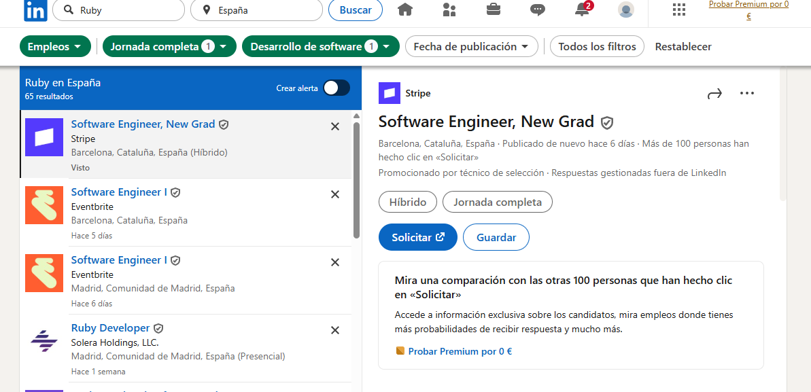

# Practica-3-entorno
# Demanda laboral de lenguajes de programación — Estudio LinkedIn

**Objetivo:** Analizar la demanda laboral de varios lenguajes de programación en LinkedIn (a nivel mundial y en España).

## Lenguajes analizados
- Java
- Python
- C#
- C
- C++
- JavaScript
- PHP
- VB .NET
- Ruby

---

## Capturas de Búsqueda

**Búsqueda: "Java" a nivel mundial.**  

**Búsqueda: "Java" en España.**  

**Búsqueda: "Python" a nivel mundial.**  

**Búsqueda: "Python" en España.**  

**Búsqueda: "C#" a nivel mundial.**  

**Búsqueda: "C#" en España.**  

**Búsqueda: "C" a nivel mundial.**  

**Búsqueda: "C" en España.**  

**Búsqueda: "C++" a nivel mundial.**  

**Búsqueda: "C++" en España.**  

**Búsqueda: "JavaScript" a nivel mundial.**  

**Búsqueda: "JavaScript" en España.**  

**Búsqueda: "PHP" a nivel mundial.**  

**Búsqueda: "PHP" en España.**  

**Búsqueda: "VB .NET" a nivel mundial.**  

**Búsqueda: "VB .NET" en España.**  

**Búsqueda: "Ruby" a nivel mundial.**  

**Búsqueda: "Ruby" en España.**  

---

## Clasificación (número de ofertas)

| Clasificación   | Lenguaje        | Todo el Mundo (ofertas)  |
|-----------------|-----------------|---------------------:|
|1                | Python          | 161.000              |
|2                | Java            | 156.000              |
|3                | JavaScript      | 151.000              |
|4                | C++             | 77.000               |
|5                | C               | 41.000               |
|6                | C#              | 26.000               |
|7                | Ruby            | 3.000                |
|8                | PHP             | 2.000                |
|9                | VB .NET         | 100                  |

| Clasificación   | Lenguaje        | España (ofertas)     |
|-----------------|-----------------|---------------------:|
|1                | Java            | 2.000                |
|1                | Python          | 2.000                |
|1                | JavaScript      | 2.000                |
|4                | C++             | 1.000                |
|5                | C               | 700                  |
|6                | C#              | 200                  |
|7                | PHP             | 100                  |
|8                | Ruby            | 65                   |
|9                | VB .NET         | 1                    |

---
